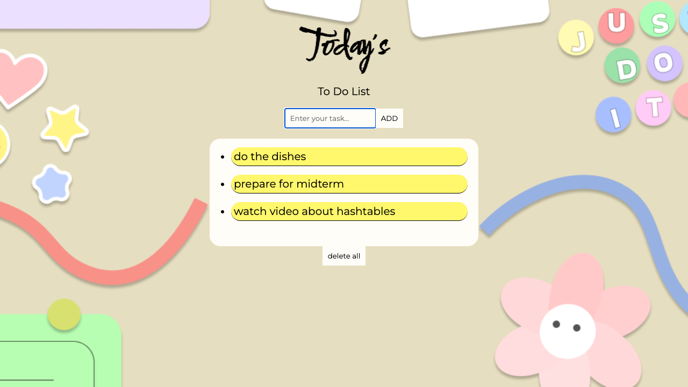

# React To-Do List

This is a simple To-Do List application built using React. It allows users to add tasks, mark them as completed, and delete them.

## Screenshots



## Contact

Daria Ignateva -destowq@gmail.com

Project Link: [https://github.com/dorpanz/ToDoList.git](https://github.com/dorpanz/ToDoList.git)

## Features

- **Add tasks:** Users can add new tasks by typing them into the input field and clicking the "ADD" button.
- **Mark tasks as completed:** Users can mark tasks as completed by clicking on them. Completed tasks will be visually distinguished from incomplete tasks.
- **Delete all tasks:** Users can delete all tasks from the list by clicking the "delete all" button.

## Usage

1. Clone the repository to your local machine:
    ```bash
    git clone https://github.com/dorpanz/ToDoList.git
    ```
2. Navigate to the project directory:
    ```bash
    cd react-todo-list
    ```
3. Install dependencies:
    ```bash
    npm install
    ```
4. Run the development server:
    ```bash
    npm start
    ```
5. Open your web browser and go to [http://localhost:3000](http://localhost:3000) to view the application.

## Dependencies

- React: JavaScript library for building user interfaces.
- React DOM: Provides DOM-specific methods that can be used at the top level of the application.
- React Scripts: Configuration and scripts for Create React App.

### Built With
* [![React][React.js]][React-url]

## Contributing

Contributions are welcome! Feel free to open an issue or submit a pull request if you find any bugs or want to suggest improvements.


<!-- MARKDOWN LINKS & IMAGES -->
<!-- https://www.markdownguide.org/basic-syntax/#reference-style-links -->
[React.js]: https://img.shields.io/badge/React-20232A?style=for-the-badge&logo=react&logoColor=61DAFB
[React-url]: https://reactjs.org/
